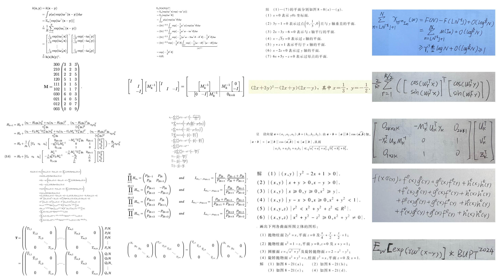

📄 English | <a href="./assets/README_zh.md">中文</a>

<div align="center">
    <h1>
         
        𝚃𝚎𝚡𝚃𝚎𝚕𝚕𝚎𝚛
        
    </h1>
    <!-- <p align="center">
        🤗 <a href="https://huggingface.co/OleehyO/TexTeller"> Hugging Face </a>
    </p> -->

  [](https://opensource.org/licenses/Apache-2.0)
  [](https://hub.docker.com/r/oleehyo/texteller)
  [](https://huggingface.co/datasets/OleehyO/latex-formulas)
  [](https://huggingface.co/OleehyO/TexTeller)

</div>

<!-- <p align="center">

  <a href="https://opensource.org/licenses/Apache-2.0">
    
  </a>
  <a href="https://github.com/OleehyO/TexTeller/issues">
    
  </a>
  <a href="https://github.com/OleehyO/TexTeller/pulls">
    
  </a>
  <a href="https://huggingface.co/datasets/OleehyO/latex-formulas">
    
  </a>
  <a href="https://huggingface.co/OleehyO/TexTeller">
    
  </a>

</p> -->

https://github.com/OleehyO/TexTeller/assets/56267907/532d1471-a72e-4960-9677-ec6c19db289f

TexTeller is an end-to-end formula recognition model based on [TrOCR](https://arxiv.org/abs/2109.10282), capable of converting images into corresponding LaTeX formulas.

TexTeller was trained with **80M image-formula pairs** (previous dataset can be obtained [here](https://huggingface.co/datasets/OleehyO/latex-formulas)), compared to [LaTeX-OCR](https://github.com/lukas-blecher/LaTeX-OCR) which used a 100K dataset, TexTeller has **stronger generalization abilities** and **higher accuracy**, covering most use cases.

>[!NOTE]
> If you would like to provide feedback or suggestions for this project, feel free to start a discussion in the [Discussions section](https://github.com/OleehyO/TexTeller/discussions).
> 
> Additionally, if you find this project helpful, please don't forget to give it a star⭐️🙏️

---

<table>
<tr>
<td>

## 🔖 Table of Contents
- [Change Log](#-change-log)
- [Getting Started](#-getting-started)
- [Web Demo](#-web-demo)
- [Formula Detection](#-formula-detection)
- [API Usage](#-api-usage)
- [Training](#️️-training)
- [Plans](#-plans)
- [Stargazers over time](#️-stargazers-over-time)
- [Contributors](#-contributors)

</td>
<td>

<div align="center">
  <figure>
    
    <figcaption>
      <p>Images that can be recognized by TexTeller</p>
    </figcaption>
  </figure>
  <div>
    <p>
      Thanks to the
      <i>
        Super Computing Platform of Beijing University of Posts and Telecommunications
      </i>
        for supporting this work😘
    </p>
    <!--  -->
  </div>
</div>


</td>
</tr>
</table>

## 🔄 Change Log

- 📮[2024-06-06] **TexTeller3.0 released!** The training data has been increased to **80M** (**10x more than** TexTeller2.0 and also improved in data diversity). TexTeller3.0's new features:

  - Support scanned image, handwritten formulas, English(Chinese) mixed formulas.

  - OCR abilities in both Chinese and English for printed images.

- 📮[2024-05-02] Support **paragraph recognition**.

- 📮[2024-04-12] **Formula detection model** released!

- 📮[2024-03-25] TexTeller2.0 released! The training data for TexTeller2.0 has been increased to 7.5M (15x more than TexTeller1.0 and also improved in data quality). The trained TexTeller2.0 demonstrated **superior performance** in the test set, especially in recognizing rare symbols, complex multi-line formulas, and matrices.

  > [Here](./assets/test.pdf) are more test images and a horizontal comparison of various recognition models.

## 🚀 Getting Started

1. Clone the repository:

   ```bash
   git clone https://github.com/OleehyO/TexTeller
   ```

2. Install the project's dependencies:

   ```bash
   pip install texteller
   ```

3. Enter the `src/` directory and run the following command in the terminal to start inference:

   ```bash
   python inference.py -img "/path/to/image.{jpg,png}" 
   # use --inference-mode option to enable GPU(cuda or mps) inference
   #+e.g. python inference.py -img "img.jpg" --inference-mode cuda
   ```

   > The first time you run it, the required checkpoints will be downloaded from Hugging Face.

### Paragraph Recognition

As demonstrated in the video, TexTeller is also capable of recognizing entire text paragraphs. Although TexTeller has general text OCR capabilities, we still recommend using paragraph recognition for better results:

1. [Download the weights](https://huggingface.co/TonyLee1256/texteller_det/resolve/main/rtdetr_r50vd_6x_coco.onnx?download=true) of the formula detection model to the`src/models/det_model/model/`directory

2. Run `inference.py` in the `src/` directory and add the `-mix` option, the results will be output in markdown format.

   ```bash
   python inference.py -img "/path/to/image.{jpg,png}" -mix
   ```

TexTeller uses the lightweight [PaddleOCR](https://github.com/PaddlePaddle/PaddleOCR) model by default for recognizing both Chinese and English text. You can try using a larger model to achieve better recognition results for both Chinese and English:

| Checkpoints | Model Description | Size |
|-------------|-------------------| ---- |
| [ch_PP-OCRv4_det.onnx](https://huggingface.co/OleehyO/paddleocrv4.onnx/resolve/main/ch_PP-OCRv4_det.onnx?download=true) | **Default detection model**, supports Chinese-English text detection | 4.70M |
| [ch_PP-OCRv4_server_det.onnx](https://huggingface.co/OleehyO/paddleocrv4.onnx/resolve/main/ch_PP-OCRv4_server_det.onnx?download=true) | High accuracy model, supports Chinese-English text detection | 115M |
| [ch_PP-OCRv4_rec.onnx](https://huggingface.co/OleehyO/paddleocrv4.onnx/resolve/main/ch_PP-OCRv4_rec.onnx?download=true) | **Default recoginition model**, supports Chinese-English text recognition | 10.80M |
| [ch_PP-OCRv4_server_rec.onnx](https://huggingface.co/OleehyO/paddleocrv4.onnx/resolve/main/ch_PP-OCRv4_server_rec.onnx?download=true) | High accuracy model, supports Chinese-English text recognition | 90.60M |

Place the weights of the recognition/detection model in the `det/` or `rec/` directories within `src/models/third_party/paddleocr/checkpoints/`, and rename them to `default_model.onnx`.

> [!NOTE]
> Paragraph recognition cannot restore the structure of a document, it can only recognize its content.

## 🌐 Web Demo

Go to the `src/` directory and run the following command:

```bash
./start_web.sh
```

Enter `http://localhost:8501` in a browser to view the web demo.

> [!NOTE]
> 1. For Windows users, please run the `start_web.bat` file.
> 2. When using onnxruntime + GPU for inference, you need to install onnxruntime-gpu.

## 🔍 Formula Detection

TexTeller’s formula detection model is trained on 3,415 images of Chinese educational materials (with over 130 layouts) and 8,272 images from the [IBEM dataset](https://zenodo.org/records/4757865), and it supports formula detection across entire images.

<div align="center">
     
</div>

1. Download the model weights and place them in `src/models/det_model/model/` [[link](https://huggingface.co/TonyLee1256/texteller_det/resolve/main/rtdetr_r50vd_6x_coco.onnx?download=true)].

2. Run the following command in the `src/` directory, and the results will be saved in `src/subimages/`

<details>
<summary>Advanced: batch formula recognition</summary>

After **formula detection**, run the following command in the `src/` directory:

```shell
python rec_infer_from_crop_imgs.py
```

This will use the results of the previous formula detection to perform batch recognition on all cropped formulas, saving the recognition results as txt files in `src/results/`.

</details>

## 📡 API Usage

We use [ray serve](https://github.com/ray-project/ray) to provide an API interface for TexTeller, allowing you to integrate TexTeller into your own projects. To start the server, you first need to enter the `src/` directory and then run the following command:

```bash
python server.py
```

| Parameter | Description |
| --------- | -------- |
| `-ckpt` | The path to the weights file,*default is TexTeller's pretrained weights*. |
| `-tknz` | The path to the tokenizer,*default is TexTeller's tokenizer*. |
| `-port` | The server's service port,*default is 8000*. |
| `--inference-mode` | Whether to use "cuda" or "mps" for inference,*default is "cpu"*. |
| `--num_beams` | The number of beams for beam search,*default is 1*. |
| `--num_replicas` | The number of service replicas to run on the server,*default is 1 replica*. You can use more replicas to achieve greater throughput.|
| `--ncpu_per_replica` | The number of CPU cores used per service replica,*default is 1*.|
| `--ngpu_per_replica` | The number of GPUs used per service replica,*default is 1*. You can set this value between 0 and 1 to run multiple service replicas on one GPU to share the GPU, thereby improving GPU utilization. (Note, if --num_replicas is 2, --ngpu_per_replica is 0.7, then 2 GPUs must be available) |
| `-onnx` | Perform inference using Onnx Runtime, *disabled by default* |

> [!NOTE]
> A client demo can be found at `src/client/demo.py`, you can refer to `demo.py` to send requests to the server

## 🏋️‍♂️ Training

### Dataset

We provide an example dataset in the `src/models/ocr_model/train/dataset/` directory, you can place your own images in the `images/` directory and annotate each image with its corresponding formula in `formulas.jsonl`.

After preparing your dataset, you need to **change the `DIR_URL` variable to your own dataset's path** in `**/train/dataset/loader.py`

### Retraining the Tokenizer

If you are using a different dataset, you might need to retrain the tokenizer to obtain a different vocabulary. After configuring your dataset, you can train your own tokenizer with the following command:

1. In `src/models/tokenizer/train.py`, change `new_tokenizer.save_pretrained('./your_dir_name')` to your custom output directory

   > If you want to use a different vocabulary size (default 15K), you need to change the `VOCAB_SIZE` variable in `src/models/globals.py`
   >
2. **In the `src/` directory**, run the following command:

   ```bash
   python -m models.tokenizer.train
   ```

### Training the Model

1. Modify `num_processes` in `src/train_config.yaml` to match the number of GPUs available for training (default is 1).
2. In the `src/` directory, run the following command:

   ```bash
   accelerate launch --config_file ./train_config.yaml -m models.ocr_model.train.train
   ```

You can set your own tokenizer and checkpoint paths in `src/models/ocr_model/train/train.py` (refer to `train.py` for more information). If you are using the same architecture and vocabulary as TexTeller, you can also fine-tune TexTeller's default weights with your own dataset.

In `src/globals.py` and `src/models/ocr_model/train/train_args.py`, you can change the model's architecture and training hyperparameters.

> [!NOTE]
> Our training scripts use the [Hugging Face Transformers](https://github.com/huggingface/transformers) library, so you can refer to their [documentation](https://huggingface.co/docs/transformers/v4.32.1/main_classes/trainer#transformers.TrainingArguments) for more details and configurations on training parameters.

## 📅 Plans

- [X] ~~Train the model with a larger dataset~~
- [X] ~~Recognition of scanned images~~
- [X] ~~Support for English and Chinese scenarios~~
- [X] ~~Handwritten formulas support~~
- [ ] PDF document recognition
- [ ] Inference acceleration
- [ ] ...

## ⭐️ Stargazers over time

[](https://starchart.cc/OleehyO/TexTeller)


## 👥 Contributors

<a href="https://github.com/OleehyO/TexTeller/graphs/contributors">
   <a href="https://github.com/OleehyO/TexTeller/graphs/contributors">
      
   </a>
</a>
